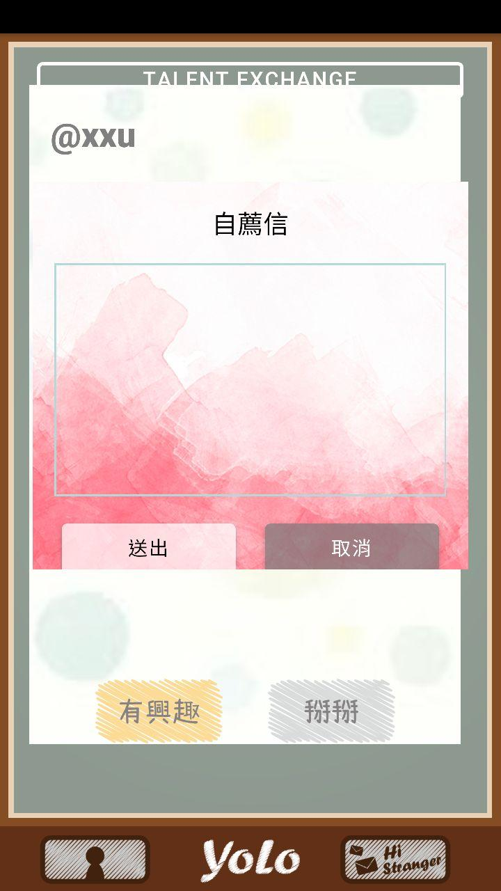

# 第三屆 元智大學創意APP實作競賽 - YoLo

**組員: 1061412 林俐秀、1061505 成書婷、1063309 張彥成**

**隊名: OuO**   

**指導老師: 葉奕成**

## 程式需求

Ionic 3

JavaScript

HTML、CSS

## 作品簡介

以分享作為起點，提供校園內師生交流的平台，增進不同科系間的交流，嘗試闡述自己對於感知到的想法。

我們希望透過軟體，讓同在一個學校的人們有更多的接觸，不侷限於課堂，不制約於課程，而是更多元更全面的互動，讓校園能夠呈現出更多不一樣元素所碰撞出的反應。

前端的部分我們藉由Ionic Framework提供的各種 UI Components，快速的生成我們APP的介面

後端的部分，我們使用JS在本地電腦架設簡易的Server，讓APP能透過網路連結到Server存取資料

> 登入&註冊

 

> 主畫面

  
 
